### Interactive Editors for Matplotlib and NetworkX


</br>

<p align="right">
    
    
</p>

</br>

### Author: Jakub Kubiś 

</br>


## Description


<div align="justify">

This library provides lightweight, browser-based editors for two common
Python visualization ecosystems:

- **Matplotlib** → editable SVG viewer with direct manipulation  
- **NetworkX** → interactive graph editor built on top of `pyvis`

Both editors run locally in the browser and communicate through temporary
files only — **no server backend and no external dependencies beyond standard
Python libraries**.

</br>


## ✨ Features

### 🖼️ MplEditor — Interactive SVG Editor for Matplotlib

`MplEditor` converts any Matplotlib figure into an SVG file and opens a local
HTML editor that allows:

- direct manipulation of SVG elements,
- editing shapes, text, paths,
- scaling, repositioning, recoloring,
- toggling visibility,
- exporting the edited image.

The editor is served on a lightweight local HTTP server and launches
automatically in your browser.

### 🔗 NxEditor — Interactive NetworkX Graph Editor

`NxEditor` turns a NetworkX graph into a dynamic pyvis visualization enriched
with custom JavaScript tools:

- node selection & highlighting  
- node deletion  
- undo history  
- physics control panel  
- node size scaling  
- font size scaling  
- export to PNG / JPEG / SVG  

All manipulations occur entirely inside the browser without mutating the
original Python graph object.
 

</div>

</br>


<br />

## 📚 Table of Contents
- 1.[Installation](#installation)
- 2.[On-line SVG adjustment](#on)
- 3.[Documentation](#doc)
  - 3.1. [Matplotlib figures adjustment](#doc1)
    - 3.1.1 [Loading matplotlib figure](#doc11)
    - 3.1.2 [Editor options](#doc12)
  - 3.2. [NetworkX figures adjustment](#doc2)
    - 3.2.1 [Loading NetworkX figure](#doc21)
    - 3.2.2 [Editor options](#doc22)
    
<br />

<br />

# 1. Installation <a id="installation"></a>

#### In command line write:

```
pip install JVectorGraph
```


# 2. On-line SVG adjustment <a id="on"></a>

<a href="https://jkubis96.github.io/JVectorGraph/" target="_blank">
  <i class="fa fa-pencil-alt"></i> Online SVG adjustment is available here 👉 JVectorGraph
</a>


# 3. Documentation <a id="doc"></a>

#### 3.1 Matplotlib figures adjustment <a id="doc1"></a>

#### 3.1.1 Loading matplotlib figure <a id="doc11"></a>

```
import matplotlib.pyplot as plt
from JVG import JVG

fig, ax = plt.subplots()
plt.plot([1,2,3])

# create MplEditor instance
editor = JVG.MplEditor(fig)

# run editor in browser 
editor.edit()
```

<br/>

#### 3.1.2 Editor options <a id="doc12"></a>

***3.1.2.1 Selecting and reorganizing graph elements***

<p align="center">

</p>

**Selecting Elements**
Using the mouse, you can select plot elements to access the available editing options.
To select multiple elements, either draw a selection box with the mouse or hold the CTRL key while clicking.

**Moving Elements**
Selected elements can be moved using the keyboard arrow keys — up, left, right, or down.

**Deselecting Elements**
Press Escape to deselect all currently selected elements.


<br />


***3.1.2.2 Graph cropping***
<p align="center">
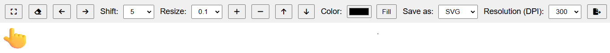
</p>


**Cropping the graph**
Select a region of interest on the plot and click the Crop button to reduce the plot view to the selected area.


<br />

***3.1.2.3 Removing graph elements***

<p align="center">
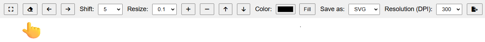
</p>

**Removing elements**
Select the elements you want to remove and click the Delete button to remove unnecessary elements from the graph.

<br />


***3.1.2.4 Undo and Redo changes***

<p align="center">

</p>


**Undo Changes**
Click the left arrow button to undo the last change.

**Redo Changes**
Click the right arrow button to redo the previously undone change.

<br />


***3.1.2.5 Elements shift range***

<p align="center">
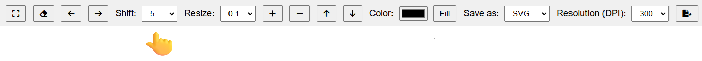
</p>


**Shift adjustment**
The movement distance of elements can be adjusted using the Shift dropdown, controlling how far elements move with each press of the arrow keys — up, down, left, or right.

<p align="center">
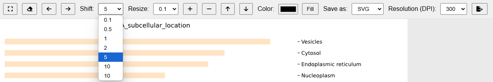
</p>


<br />

***3.1.2.6 Resize objects***

<p align="center">

</p>

**Select resize factor**
Choose the resize factor to adjust the size of selected objects (graph elements).

<p align="center">
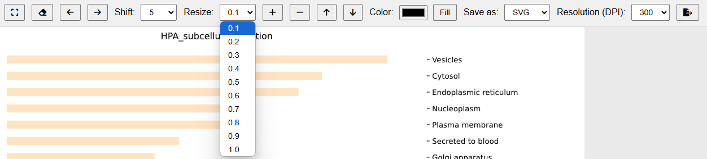
</p>


**Resize selected elements**
Use the + button to increase and the - button to decrease the size of selected elements according to the chosen resize factor.


<br />


***3.1.2.7 Change objects order (Z-order)***

<p align="center">
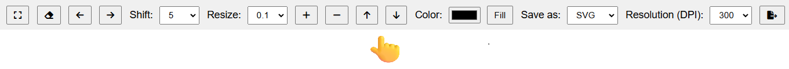
</p>


**Move down**
Select an object and move it down in the stacking order, placing it behind other elements.

**Move up**
Select an object and move it up in the stacking order, bringing it in front of other elements.

<br />


***3.1.2.8 Change object color***

<p align="center">
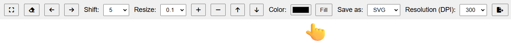
</p>

**Select color**
Select a color from the palette.

<p align="center">
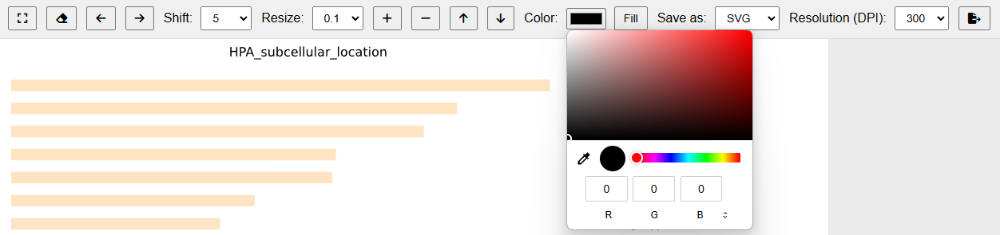
</p>


**Fill selected object**
Select an object and click the Fill button to change its color.

<br />


***3.1.2.9 Save adjusted graph***

<p align="center">
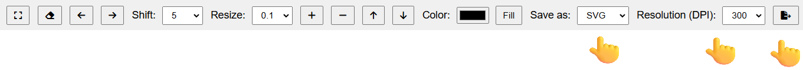
</p>


**Select output format**
Choose the file format for saving the figure: SVG, PNG, or JPG.

<p align="center">
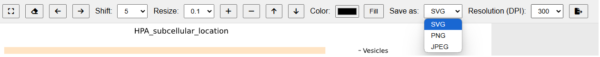
</p>


**Select figure resolution**
Set the figure resolution in DPI before saving.

<p align="center">
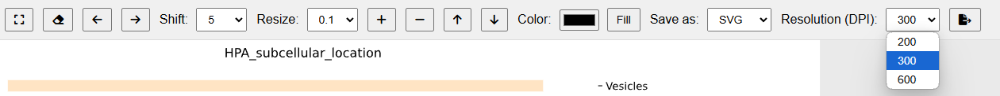
</p>

<br />
<br />


#### 3.2 NetworkX figures adjustment <a id="doc2"></a>

#### 3.2.1 Loading NetworkX figure <a id="doc21"></a>

```
import networkx as nx
from JVG import JVG

G = nx.path_graph(5)

sizes = [300, 500, 800, 500, 300]  

nx.draw(G, with_labels=True, node_size=sizes)
    
# create NxEditor instance
editor = JVG.NxEditor(G)

# run editor in browser 
editor.edit()
```

#### 3.2.2 Editor options <a id="doc22"></a>

***3.2.2.1 Selecting and reorganizing graph elements***

<p align="center">
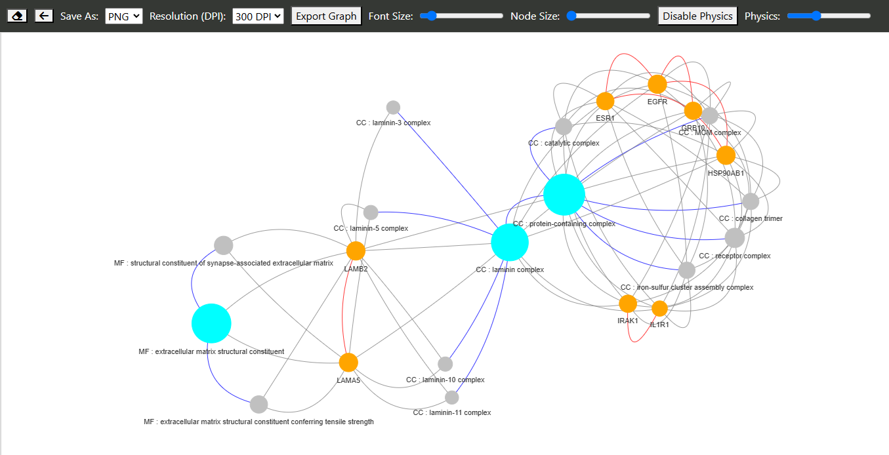
</p>

**Selecting Elements**
Using the mouse, you can select plot elements to access the available editing options.
To select multiple elements, either draw a selection box with the mouse or hold the CTRL key while clicking.

**Moving Elements**
Selected elements can be moved using the keyboard arrow keys — up, left, right, or down.

**Deselecting Elements**
Press Escape to deselect all currently selected elements.


<br />

***3.2.2.2 Removing network elements***

<p align="center">
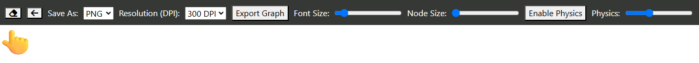
</p>

**Removing elements**
Select the elements you want to remove and click the Delete button to remove unnecessary elements from the graph.

**Selected elements:**

<p align="center">
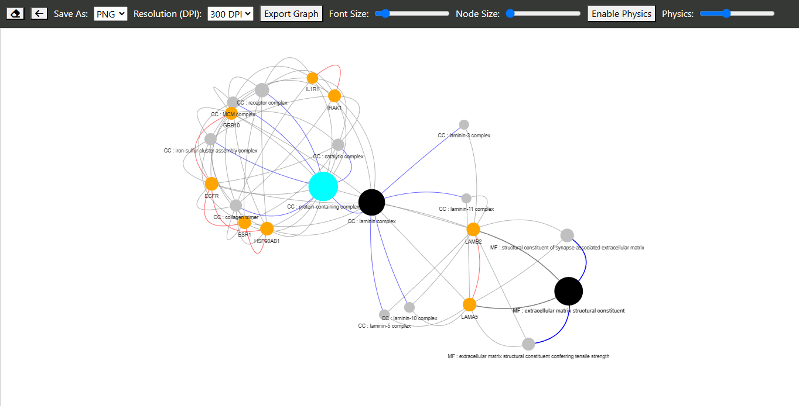
</p>


**After remove:**

<p align="center">
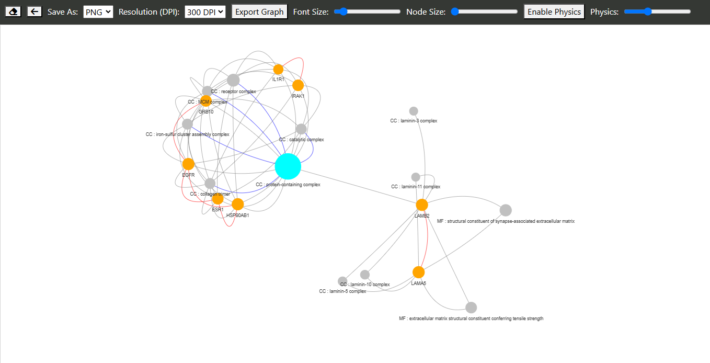
</p>


<br />


***3.2.2.3 Undo changes***

<p align="center">
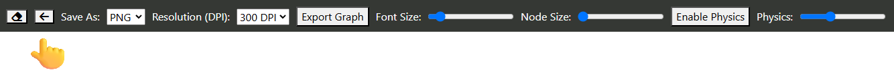
</p>


**Undo Changes**
Click the left arrow button to undo the last change.

<br />


***3.2.2.4 Save adjusted graph***

<br />
<p align="center">
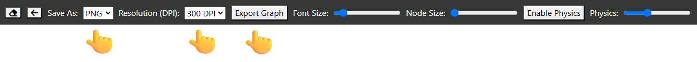
</p>


**Select output format**
Choose the file format for saving the figure: SVG, PNG, or JPG.

<p align="center">
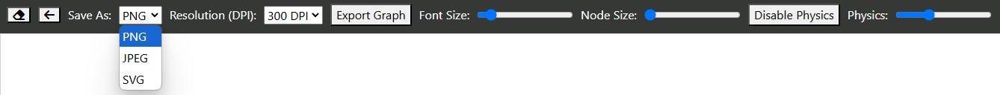
</p>


**Select figure resolution**
Set the figure resolution in DPI before saving.


<p align="center">
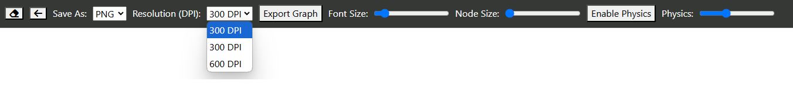
</p>

<br />


***3.2.2.5 Change nodes font size***

<p align="center">
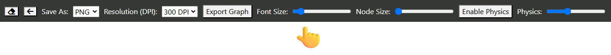
</p>

<br />


***3.2.2.6 Change node points size***

<p align="center">
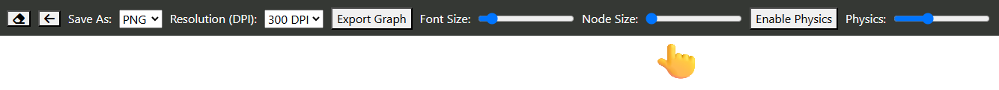
</p>

<br />


***3.2.2.7 Toggle network physics***

<p align="center">
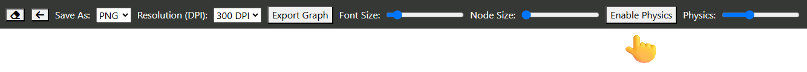
</p>

**Enable/Disable physics**
This function allows you to toggle network physics on or off in a graph or diagram, enabling automatic placement of nodes and edges based on physical forces (e.g., attraction and repulsion between nodes).
Turning off the physics allows you to manually adjust and move overlapping or hidden nodes, and then save the layout.

<p align="center">
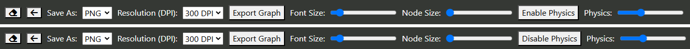
</p>

<br />

***3.2.2.8 Adjust network physics***

**Adjust physics strength**
Use this option to increase or decrease the strength of the physical forces between nodes, controlling how strongly they attract or repel each other.

<p align="center">
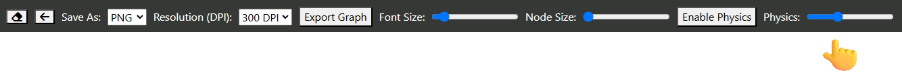
</p>


### Have fun JBS